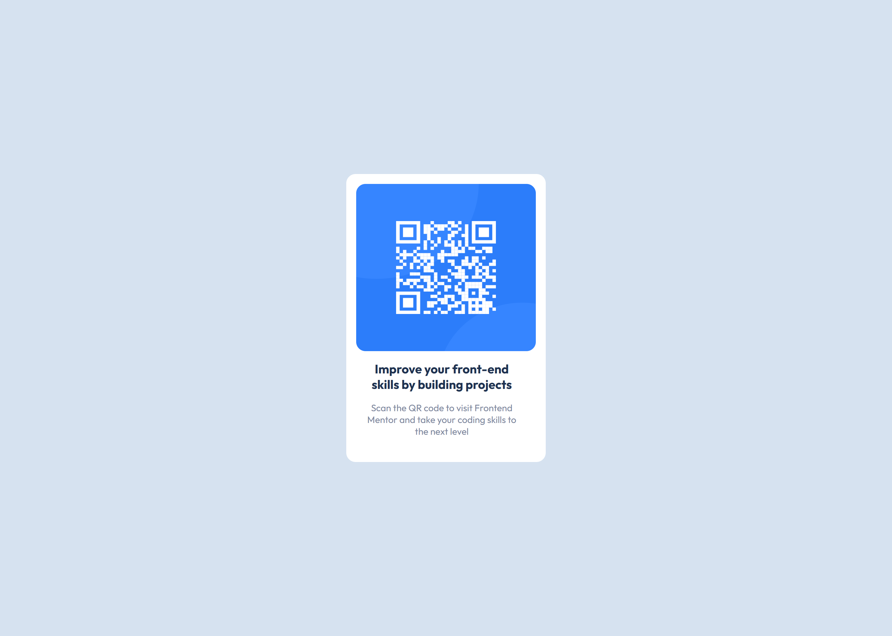

# Frontend Mentor - QR code component solution

This is a solution to the [QR code component challenge on Frontend Mentor](https://www.frontendmentor.io/challenges/qr-code-component-iux_sIO_H). Frontend Mentor challenges help you improve your coding skills by building realistic projects.

## Table of contents

- [Frontend Mentor - QR code component solution](#frontend-mentor---qr-code-component-solution)
  - [Table of contents](#table-of-contents)
  - [Overview](#overview)
    - [Screenshot](#screenshot)
    - [Links](#links)
  - [My process](#my-process)
    - [Built with](#built-with)
    - [What I learned](#what-i-learned)
    - [Useful resources](#useful-resources)
  - [Author](#author)

## Overview

### Screenshot

### Links

- Solution URL: [GitHub](https://github.com/MerlinDaily/QR-component-hub)
- Live Site URL: [GitHub Pages](https://merlindaily.github.io/QR-component-hub/)

## My process

I used a mobile-first approach as it was more convenient.

### Built with

- Vanilla-flavoured HTML and CSS (Sass as preprocessor).

### What I learned

Media queries... oh and "box-sizing: border-box;"? Pretty convenient.

### Useful resources

- [MDN Web Docs](https://developer.mozilla.org/en-US/) and [w3schools](https://www.w3schools.com/) for documentation.

## Author

- Frontend Mentor - [@MerlinDaily](https://www.frontendmentor.io/profile/MerlinDaily)
- GitHub - [MerlinDaily](https://github.com/MerlinDaily)
